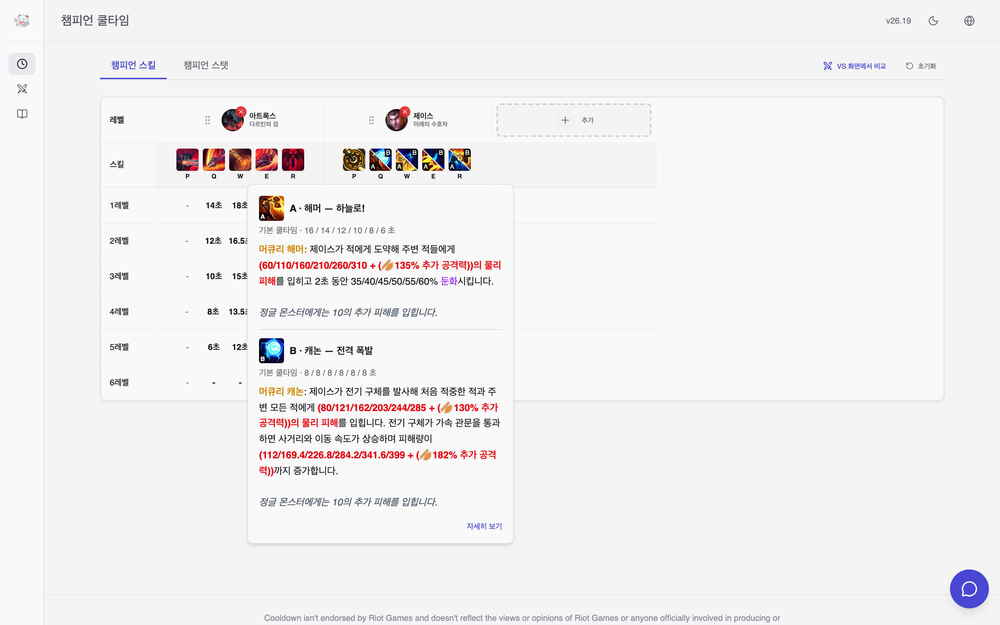
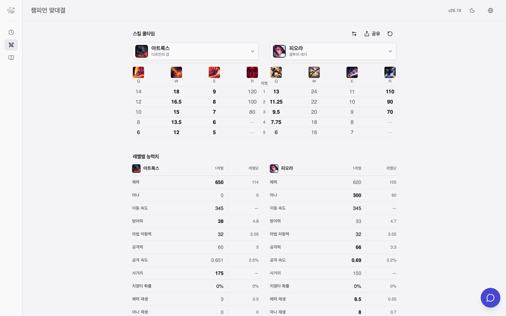
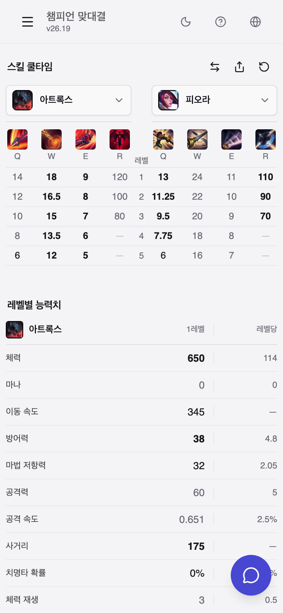

# cooldown

[English](README.md) · **한국어** · [简体中文](README.zh-CN.md)

게임 시작 전에 스킬 쿨타임을 확인합니다. 리그 오브 레전드의 모든 챔피언 스킬 쿨타임을 인게임 설명과 함께 보여주고, 내 챔피언과 상대를 나란히 놓고 비교하는 정적 웹 앱입니다.

서비스: https://seokh1213.github.io/cooldown/

## 폴더 구조

실행 코드·배포 파일·개발 자료를 세 영역으로 나눕니다.

```text
src/       # 앱 코드
public/    # 공개 배포 데이터·이미지·모델
dev/       # 도구·테스트·문서·원본·조사 기록
```

[폴더 기준과 읽는 순서](dev/docs/project-structure.md)

## 스킬 쿨타임과 설명

173개 챔피언 전부. P/Q/W/E/R 랭크별 쿨타임, 비용, 랭크별 수치와 계수를 Riot 계산 데이터에서 그대로 렌더링한 인게임 설명과 함께 보여줍니다. 제이스처럼 두 폼을 가진 챔피언은 A/B 로 나눠 보입니다.



## VS 상성 비교

내 챔피언과 상대를 고릅니다. 전체 랭크 쿨타임을 한 표에서, 레벨별 기본 능력치와 함께 봅니다. 교체와 URL 공유를 지원하고 휴대폰에서도 동작합니다.





## 그 밖에

- 챔피언 이야기·스킨, 룬, 아이템, 소환사 주문 백과사전
- 한국어, 영어, 중국어
- 오프라인에서도 동작하는 설치형 PWA
- 선택형 롤 지식 도우미. 모델은 브라우저 안에서만 돌고 서버로 보내지 않습니다. `dev/docs/advisor-answer-pipeline.md` 참고.

## 데이터

GitHub Actions 워크플로가 매시간 Data Dragon 과 CommunityDragon 을 확인해 정적 데이터를 다시 만들고, 테스트를 통과한 산출물만 GitHub Pages 에 배포합니다. 브라우저는 미리 계산된 결과만 읽습니다. 서버는 없습니다. 현재 패치와 원본 버전은 `public/data/version.json` 에 있습니다.

## 개발

Node.js 24.

```bash
npm ci
npm run dev
```

배포 빌드와 PWA 를 그대로 띄우는 로컬 미리보기(`http://127.0.0.1:4173/cooldown/`):

```bash
npm run preview:local
```

전체 검증:

```bash
npm run type-check
npm run lint
npm test
npm run build
npm run test:e2e
```

현재 패치 데이터를 로컬에서 다시 만들려면 `npm run generate-static-data` 를 실행합니다.

## 더 보기

- `dev/docs/product-roadmap.md`: 우선순위와 완료 기준
- [데이터 버전과 PWA 갱신](dev/docs/data-and-updates.md)
- [지식 도우미 설계](dev/docs/advisor-answer-pipeline.md), [지식 작성 지침](dev/data/knowledge/README.md)
- [패치 변경 내역](dev/docs/patch-notes.md)

## 라이선스

Apache License 2.0
