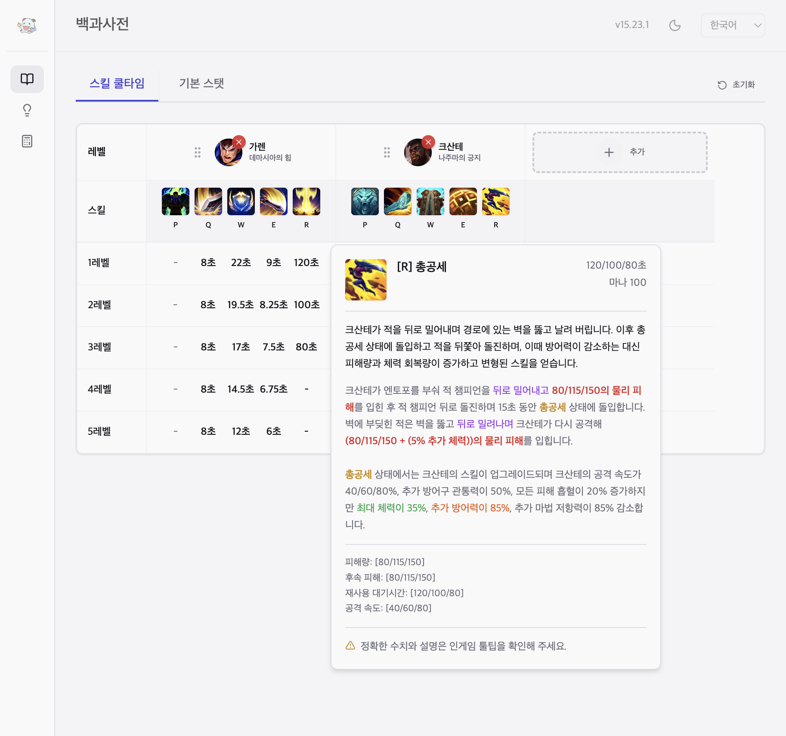
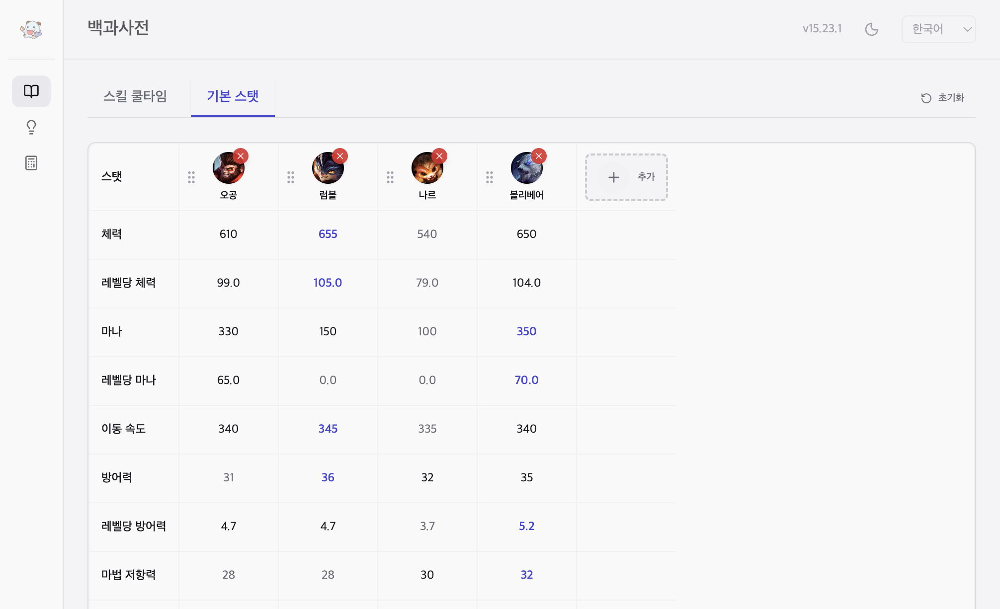
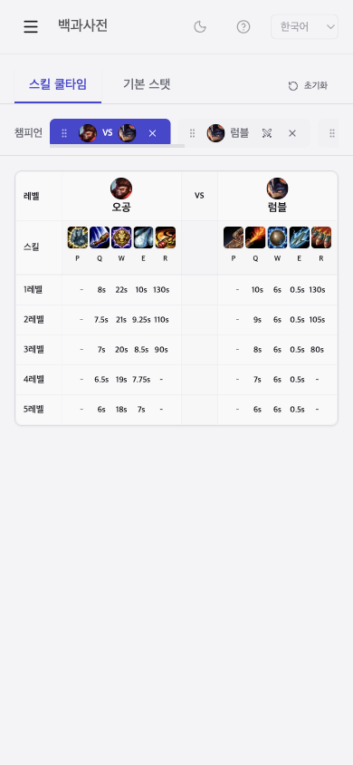
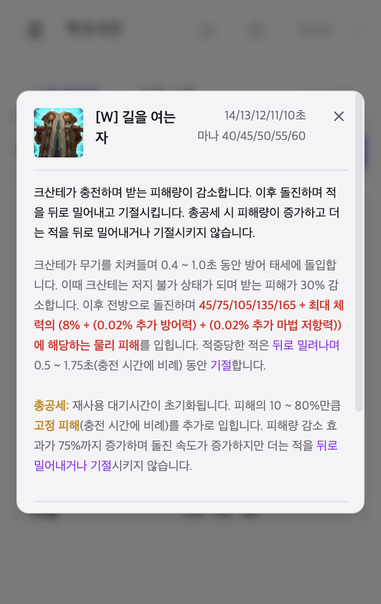

# LoL Champion Skill Cooldown & Stats Comparison

리그 오브 레전드 챔피언의 스킬 쿨타임과 기본 스탯을 비교할 수 있는 웹 애플리케이션입니다.

🌐 **Live Demo**: https://seokh1213.github.io/cooldown/

---

## 주요 기능

### 스킬 쿨타임 비교
- 챔피언별 스킬 쿨타임을 레벨별로 확인
- 여러 챔피언을 동시에 비교하여 분석
- 스킬 아이콘 호버/클릭 시 상세 툴팁 제공

### 기본 스탯 비교
- 체력, 마나, 방어력, 마법 저항력 등 기본 스탯 확인
- 레벨당 성장 스탯 정보 제공
- VS 모드를 통한 1:1 비교

### 상세 스킬 툴팁
- 스킬 아이콘 호버(데스크톱) 또는 클릭(모바일)으로 상세 정보 확인
- 스킬 설명, 쿨타임, 마나 비용, 레벨별 통계 정보 제공
- 패시브 스킬 정보도 지원
- 모바일에서는 전체 화면 다이얼로그로 편리하게 확인

### 반응형 디자인
- 데스크탑과 모바일 환경 모두 지원
- 모바일 최적화된 UI/UX (iPhone 12 Pro 기준)
- 터치 제스처 지원

---

## 스크린샷

### 데스크탑 버전

#### 스킬 쿨타임
여러 챔피언의 스킬 쿨타임을 한눈에 비교할 수 있습니다.


#### 스킬 툴팁
스킬 아이콘에 마우스를 올리면 상세 정보가 툴팁으로 표시됩니다.



#### 기본 스탯
챔피언의 기본 스탯과 레벨당 성장 스탯을 확인할 수 있습니다.



### 모바일 버전 (iPhone 12 Pro)

#### 스킬 쿨타임
모바일에서도 편리하게 스킬 쿨타임을 확인할 수 있습니다.



#### 스킬 툴팁 (모바일용)
스킬 아이콘을 탭하면 전체 화면 다이얼로그로 상세 정보를 확인할 수 있습니다.



#### 기본 스탯
모바일 최적화된 기본 스탯 화면입니다.


---

## 기술 스택

- **Frontend Framework**: React 19
- **Build Tool**: Vite
- **Styling**: Tailwind CSS
- **UI Components**: Radix UI
- **Drag & Drop**: @dnd-kit
- **Routing**: React Router DOM
- **Language**: TypeScript

---

## 개발 환경 설정

```bash
# 의존성 설치
npm install

# 개발 서버 실행
npm run dev

# 프로덕션 빌드
npm run build

# 빌드 미리보기
npm run preview
```

---

## 주요 기능 상세

### 챔피언 선택
- 검색 기능을 통한 빠른 챔피언 찾기
- 여러 챔피언 동시 선택 및 비교
- 드래그 앤 드롭으로 챔피언 순서 변경

### VS 모드
- 두 챔피언을 선택하여 1:1 비교
- 스탯 차이를 시각적으로 강조 표시
- 스킬 쿨타임 비교를 통한 전략 수립

### 스킬 툴팁
- **데스크톱**: 스킬 아이콘에 마우스를 올리면 툴팁으로 상세 정보 표시
- **모바일**: 스킬 아이콘을 탭하면 전체 화면 다이얼로그로 상세 정보 표시
- 스킬 설명, 쿨타임, 마나 비용 등 기본 정보 제공
- 레벨별 통계 정보 (데미지, 효과 등) 표시
- 패시브 스킬 정보도 지원
- 게임 내 툴팁과 유사한 형식으로 정보 제공

### 데이터 관리
- 로컬 스토리지를 통한 선택 챔피언 저장
- 버전별 데이터 캐시 관리
- 자동 데이터 업데이트

---

## 라이선스

이 프로젝트는 Apache License 2.0을 따릅니다.
