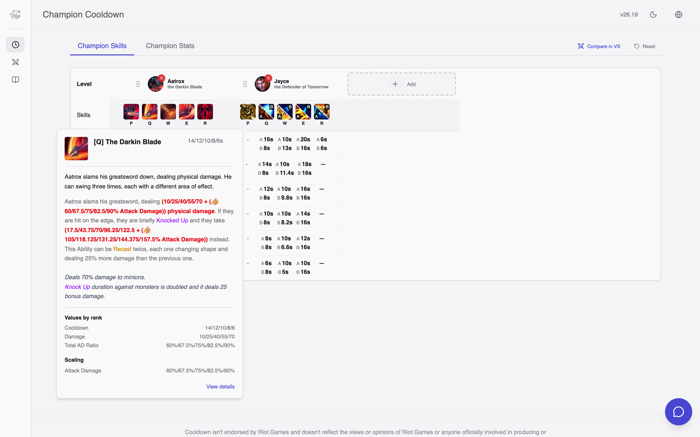
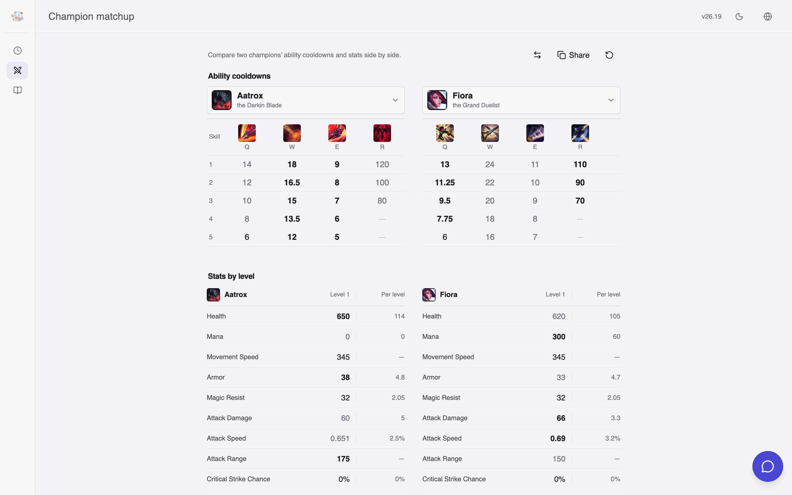
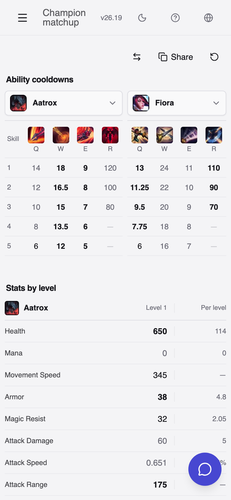

# cooldown

**English** · [한국어](README.ko.md) · [简体中文](README.zh-CN.md)

Check ability cooldowns before the game starts. A static web app for League of Legends that shows every champion's ability cooldowns with the full in-game description, and puts your champion and the opponent side by side.

Live: https://seokh1213.github.io/cooldown/

## Ability cooldowns and descriptions

All 173 champions. P/Q/W/E/R cooldowns by rank, cost, per-rank values and scaling ratios, with the in-game description rendered from Riot's own calculation data. Champions with two forms, such as Jayce, show both as A and B.



## VS matchup

Pick your champion and the opponent. Every rank's cooldown in one table, base stats by level, swap and share by URL. Works on phones.





## Also included

- Runes, items and summoner spells encyclopedia
- Korean, English and Simplified Chinese
- Installable PWA that works offline
- Optional LoL knowledge helper. The model runs inside the browser and nothing is sent to a server. See `docs/advisor-answer-pipeline.md`.

## Data

A GitHub Actions workflow checks Data Dragon and CommunityDragon every hour, regenerates the static data, runs the tests and deploys to GitHub Pages. The browser reads precomputed results only. There is no server. The current patch and source versions are in `public/data/version.json`.

## Development

Node.js 24.

```bash
npm ci
npm run dev
```

Local preview with the production build and PWA (`http://127.0.0.1:4173/cooldown/`):

```bash
npm run preview:local
```

Full checks:

```bash
npm run type-check
npm run lint
npm test
npm run build
npm run test:e2e
```

Regenerate the current patch's data locally with `npm run generate-static-data`.

## More

- `docs/product-roadmap.md`: priorities and done criteria
- `docs/pwa-updates.md`: PWA release and update rules
- `docs/versioning.md`: patch and source version rules
- `docs/local-llm-advisor.md`, `knowledge/README.md`: the knowledge helper

## License

Apache License 2.0
