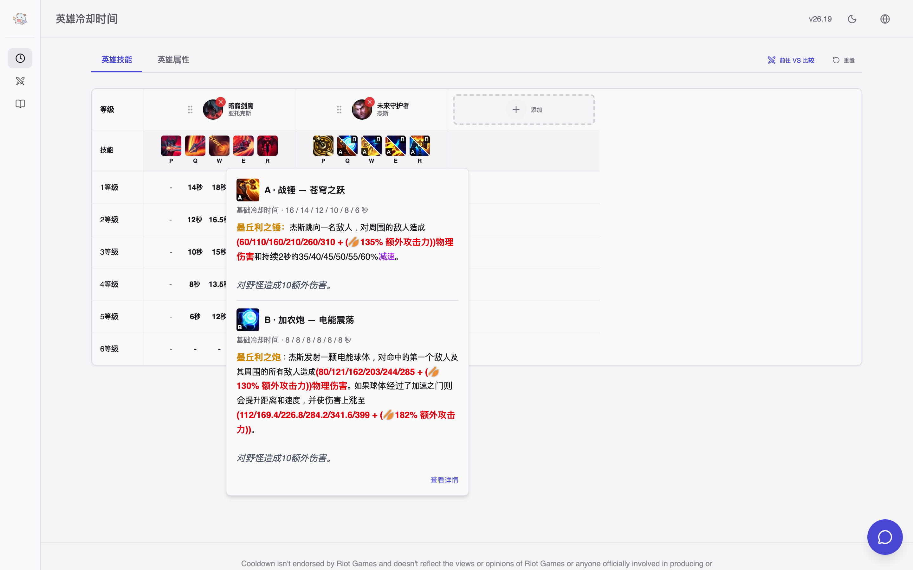
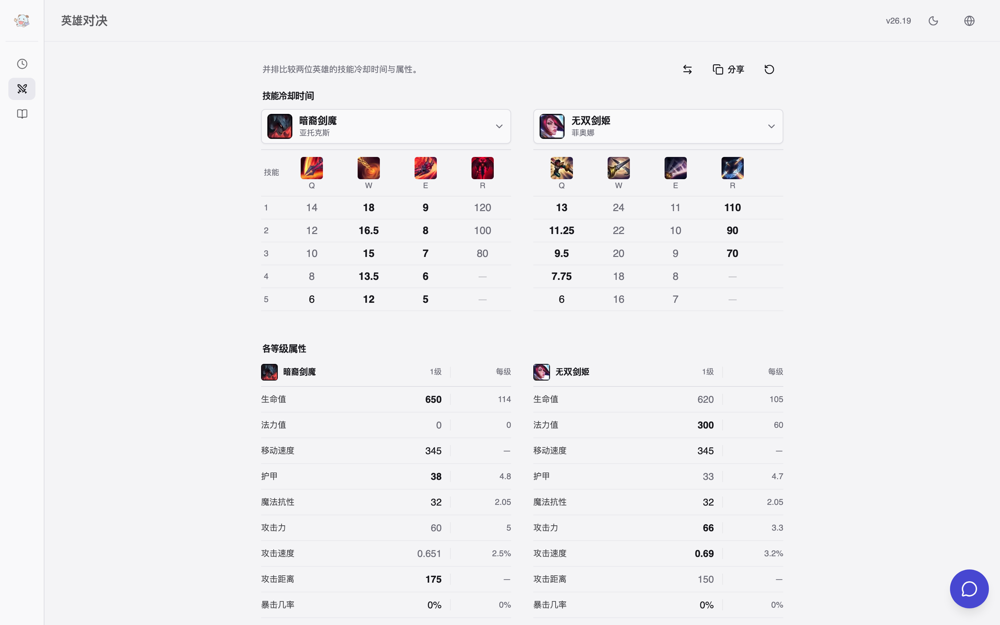
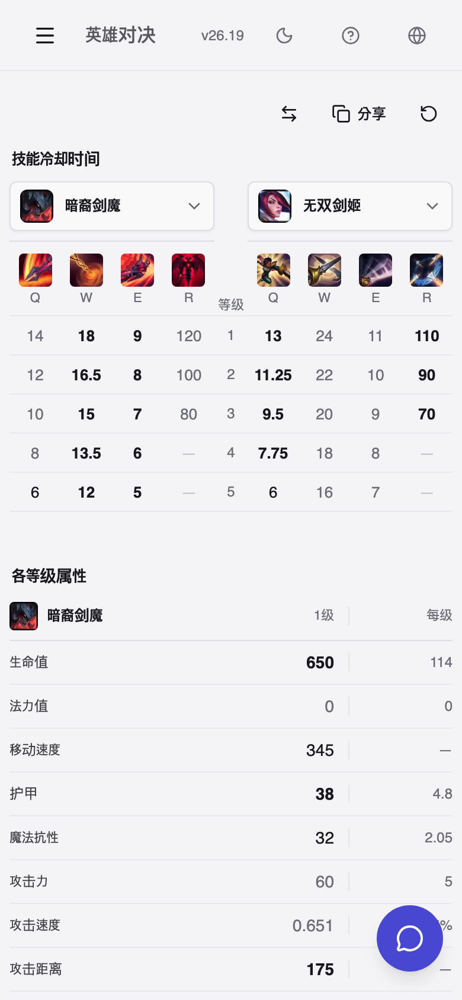

# cooldown

[English](README.md) · [한국어](README.ko.md) · **简体中文**

在开局前查看技能冷却。这是一个英雄联盟静态网页应用：展示所有英雄的技能冷却时间和完整的游戏内技能说明，并把你的英雄与对手并排比较。

站点：https://seokh1213.github.io/cooldown/

## 技能冷却与说明

覆盖全部 173 位英雄。P/Q/W/E/R 各等级冷却、消耗、各等级数值与加成系数，技能说明直接由 Riot 的计算数据渲染。杰斯这类双形态英雄会分为 A/B 两栏显示。



## VS 对线比较

选择你的英雄和对手。所有等级的冷却在一张表里，附带各等级基础属性，支持互换和 URL 分享。手机上也可使用。





## 其他功能

- 英雄背景故事与皮肤、符文、装备、召唤师技能百科
- 韩语、英语、简体中文
- 可安装、可离线使用的 PWA
- 可选的英雄联盟知识助手。模型只在浏览器内运行，不向任何服务器发送数据。参见 `docs/advisor-answer-pipeline.md`。

## 数据

GitHub Actions 工作流每小时检查 Data Dragon 与 CommunityDragon，重新生成静态数据，只把通过测试的产物部署到 GitHub Pages。浏览器只读取预先计算好的结果，没有服务器。当前版本号与数据源版本见 `public/data/version.json`。

## 开发

Node.js 24。

```bash
npm ci
npm run dev
```

以生产构建和 PWA 运行的本地预览（`http://127.0.0.1:4173/cooldown/`）：

```bash
npm run preview:local
```

完整检查：

```bash
npm run type-check
npm run lint
npm test
npm run build
npm run test:e2e
```

在本地重新生成当前版本的数据：`npm run generate-static-data`。

## 更多

- `docs/product-roadmap.md`：优先级与完成标准
- [数据版本与 PWA 更新](docs/data-and-updates.md)
- [知识助手设计](docs/advisor-answer-pipeline.md)、[知识编写指南](knowledge/README.md)
- [补丁变更记录](docs/patch-notes.md)

## 许可证

Apache License 2.0
