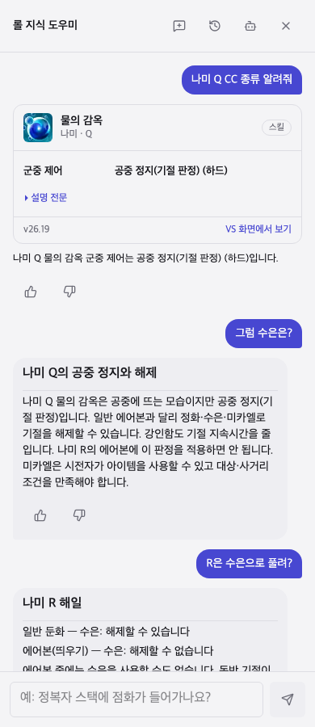

# CC 질문·대화 전반 점검 — 2026-10-02

비교 기준: `4bba44708`, PC 롤 자료 패치 `26.19`.

## 요청별 확인

| 범위 | 완료 조건과 결과 | 근거 |
|---|---|---|
| 전체 스킬 조회 흐름 | 173챔피언·865슬롯 각각 CC 조회 후 “그럼 정화는?”에서 챔피언·슬롯 유지 | 실제 `answerDialogue`, 대화 저장·복원 포함 전수 시험 |
| 질문 초점 변화 | 종류·순서·정화·수은·미카엘·강인함·강타·쿨·사거리·소모 구분 | 50대화·115턴, 이름 없는 후속 질문과 역순 질문 포함 |
| 주제·슬롯 변경 | 나미 Q의 기절 해제 규칙을 R에 적용하지 않음. 다른 챔피언·스탯·일반 규칙으로 이동하면 이전 CC 맥락 제거 | 여러 턴 시험, Chrome·390px·1280px 확인 |
| 일반 CC 대화 | “제압 정화로 풀려?” 뒤 “수은은?”·“미카엘은?”·“강인함은?”·“강타는?”에서 제압 유지 | 노트의 구조화된 CC 유형을 저장하고 복원 |
| 확인되지 않은 판정 | 복사·반사·추정 효과에 검토한 해제 규칙을 단정하지 않음. 확인된 순서 노트가 없으면 자료 부족 안내 | 사일러스, 자기 둔화, CC 없음, 노틸러스·알리스타·벨코즈·카밀 순서 질문 |
| 이미지·화면 | 기존 모든 챔피언 스킬 이미지 자산 검사 유지, 실제 카드 아이콘 표시·로드 확인 | 전체 썸네일 자료 시험, 브라우저 이미지 디코딩 검사, 화면 캡처 |
| 기존 기능 | 상성 조언·스탯·수치 조회와 이전 CC 질문 유지 | 단위·자료 시험 1,950건, 이전 CC 브라우저 시험 포함 |

전수 시험은 **조회와 대화 대상 유지의 범위**다. 모든 스킬의 게임 판정을 PC 클라이언트에서 재현했다는 뜻은 아니다.

## 발견한 문제

1. 스킬 종류 조회는 되지만 해제 질문을 아이템·소환사 주문의 일반 설명으로 처리했다. 예: “나미 Q 수은으로 풀려?”에 스킬 요약이 나왔다.
2. 해제 노트가 문자열 답변이면 대화 주제가 일반 규칙으로 바뀌어, 다음 “수은은?”에서 앞 스킬을 놓쳤다. 정화·수은·미카엘·강인함·강타를 연속으로 물으면 문제가 반복됐다.
3. 리 신의 특정 순서 노트가 없는 다른 스킬에서는 순서를 물어도 CC 종류 카드만 반복했다. 종류 배열을 시간 순서로 해석할 근거는 없었다.
4. “기절 스킬 쿨타임”에서 효과 낱말이 명시한 쿨타임보다 우선했다.
5. 특정 챔피언의 예외 노트에 슬롯 조건이 없어 다른 스킬에도 적용될 여지가 있었다. 같은 챔피언의 전체 CC 질문을 최근 단일 슬롯으로 좁히는 문제도 함께 막았다.

문제는 앱의 공통 계획기, 코드 기억, 사실 초점의 선택 순서에서 발생했다.

## 공통 흐름 수정

- `controlQuery`: 종류·순서·해제·강인함·강타를 구분한다. 명시한 쿨·사거리·계수·피해량 조회는 기존 사실 흐름에 맡긴다.
- `ControlContext`: 직전 판정의 챔피언·슬롯 또는 일반 CC 유형을 저장한다. 노트 본문에서 대상이나 유형을 다시 추측하지 않는다. 다른 주제의 답변이 나오면 지운다. 수호천사·점화처럼 명시한 새 규칙은 직전 스킬보다 먼저 처리한다.
- `controlSubject`: 후속 질문은 직전 스킬/판정에만 연결한다. 새로운 이름·슬롯을 우선하고, 여러 후보면 확인 질문을 한다. 명시한 전체 스킬 조회는 최근 한 슬롯으로 좁히지 않는다.
- `CONTROL_INTERACTIONS`: 검토한 유형별 해제·강인함 규칙을 `known` 스킬 효과에 결합한다. 자기·아군·비챔피언 대상과 복사·반사·추정 효과를 일반 적 CC로 취급하지 않는다. 고정·행동 가능한 끌림·즉시 판정의 해제는 확정하지 않는다.
- 특정 스킬 예외 노트는 `subjects`로 챔피언·슬롯을 제한한다. 일반 CC 노트는 `controls`로 이어 묻기의 주제를 기록한다. 노트 로더는 슬롯과 유형을 검사한다.
- 졸음→수면은 확인된 유형 규칙으로 설명한다. 다른 스킬의 단계는 검토한 노트를 사용하며, 없으면 확인한 종류와 자료 부족 안내를 제공한다.

## 추가로 기록한 판정

현재 출처 노트는 28개, 기존 규칙을 합친 번들 판정 문서는 35개다. 다음 3개 예외 노트를 한국어·영어·중국어와 출처·검토일을 포함해 추가했다.

| 판정 | 기록한 내용 | 출처 |
|---|---|---|
| 나미 Q | 공중 정지는 기절 판정. 정화·수은·미카엘 해제 및 강인함 적용. 나미 R 에어본과 구분 | [PC 나미 스킬](https://leagueoflegends.fandom.com/wiki/Nami/LoL), [수은 세부 판정](https://leagueoflegends.fandom.com/wiki/Quicksilver_Sash?page=2&title=Quicksilver_Sash) |
| 그레이브즈 W | 정화·미카엘로 시야 축소 해제 불가. 수은의 공유 시야 상실 해제와 연막 영역·안팎의 시야 차단은 별개 | [시야 축소 규칙](https://leagueoflegends.fandom.com/wiki/Types_of_Crowd_Control) |
| 녹턴 R | 수은으로 자신의 시야 축소 해제 가능. 다른 아군 전체의 효과까지 해제하거나 후속 돌진·피해를 취소하는 것은 아님 | [시야 축소 규칙](https://leagueoflegends.fandom.com/wiki/Types_of_Crowd_Control), [수은 세부 판정](https://leagueoflegends.fandom.com/wiki/Quicksilver_Sash?page=2&title=Quicksilver_Sash) |

유형별 규칙의 출처는 [CC 요약](https://leagueoflegends.fandom.com/wiki/Types_of_Crowd_Control/Summary), [CC 해제 규칙](https://leagueoflegends.fandom.com/wiki/Crowd_control), [CC 상세](https://leagueoflegends.fandom.com/wiki/Types_of_Crowd_Control), [정화 자료](https://leagueoflegends.fandom.com/wiki/Module%3ASpellData/data)다. 미카엘의 간단한 아이템 설명과 상세 예외 목록이 달라, 실명·무장 해제·시야 축소는 상세 유형별 예외를 사용했다. 고정 해제는 자료의 차이가 있어 일반화하지 않았다.

리 신 R의 속박 해제와 시전 취소 조건은 [이전 조사](../crowd-control/leesin-review.md)를 유지했다. 새로운 작업에서 게임 내 프레임·피해 판정을 직접 재현하지는 않았다.

## 비교와 검사

| 검사 | 수정 전 | 수정 후 |
|---|---:|---:|
| 같은 50대화·115턴, 판정기 없음 | 44/115 | 115/115 |
| 같은 질문, 오프라인 판정기 | 44/115 | 115/115 |
| 865슬롯 CC→정화 대화 대상 유지 | 이번에 추가한 검사 | 865/865 |
| 단위·자료 시험 전체 | 이전 작업 1,897건 | 1,950/1,950 |
| 모바일·데스크톱 CC 브라우저 시험 | 이전 작업 5건 | 재시도 없이 7/7 |
| 타입 검사·ESLint·빌드·Pages 아티팩트 준비 | — | 통과 |

`before.json`은 별도 checkout의 **수정 전 코드**에서 같은 질문 파일로 실행했다. `after.json`에는 수정본의 실제 답변과 단언 결과를 남겼다. 한국어 질문 묶음 외에 영어·중국어 후속 질문도 코드 시험으로 확인했다. 직접 조회 시험은 모델을 부르면 실패하도록 했다.

질문 묶음은 발견한 문제를 겨냥한 회귀 검사다. `115/115`는 임의의 모든 질문에 대한 정확도 점수가 아니다. 보유 자료가 없는 순서·해제 조건은 만들어내지 않고 안내하는 것도 완료 조건에 포함된다.

## 실행 비용과 다시 실행

질문 비교·전수 조회는 Node에서 먼저 실행했다. 질문 묶음 평가는 약 2~7초, 단위·자료 시험은 약 13초, 선택한 브라우저 시험은 약 15~17초였다. Chrome은 대표 흐름과 최종 공개 배포 확인에 사용한다.

```bash
npm run llm:bundle
npx tsx dev/scripts/advisor/eval-dialogue-coverage.ts dev/research/llm-evals/control-audit/after.json dev/research/llm-evals/control-audit/questions.json 4bba44708
node --import tsx --test --test-reporter=spec 'dev/tests/unit/*.test.ts' 'dev/tests/data/*.test.ts'
npm run build
npm run test:e2e -- dev/tests/e2e/advisor-crowd-control.spec.ts --retries 0
```


