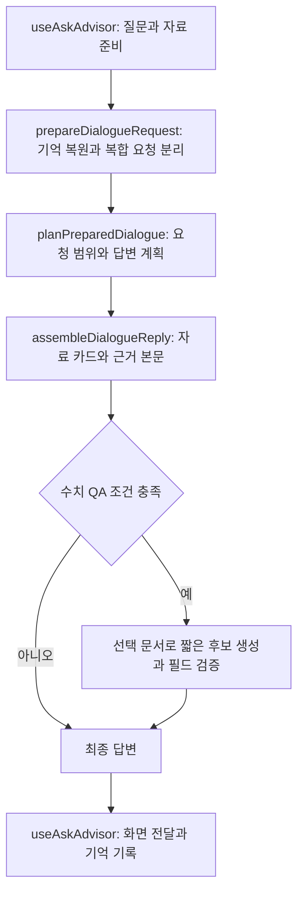

# 롤 지식 도우미의 현재 설계

2026-10-06 소스 기준. 현재 앱의 진입점은 `answerDialogue`이며, 게임 자료로 만든 카드·본문에 요청 분류와 제한적 수치 QA를 더한다. 모델 설정이나 실행 조건이 바뀌면 이 문서도 해당 코드와 함께 갱신한다.

초기 Ollama 설계는 [local-llm-advisor.md](local-llm-advisor.md), 이 문서의 이전 설계·측정표는 [2026-10-06 정리 전 원본](../research/design-notes/advisor-answer-pipeline-before-2026-10-06.md)에 보존한다. 당시 명령·가격·평가 결과는 과거 기록이며, 현행 동작과 구분한다.

## 실행과 모델 다운로드

[DeferredAdvisorWidget](../src/components/features/advisor/DeferredAdvisorWidget.tsx)은 처음에 실행 버튼만 렌더링한다. 버튼을 누르면 위젯 코드를 동적 import한다. 이전에 모델 다운로드에 동의한 기기에서는 유휴 시간에 코드를 미리 불러온다(`requestIdleCallback`의 timeout 2,000ms, 대체 타이머 1,500ms).

[AdvisorWidget](../src/components/features/advisor/AdvisorWidget.tsx)이 자료·대화 기록·모델 상태를 연결한다. 창을 닫으면 패널을 숨기고 현재 상태를 유지한다. 위젯 모듈 로드 실패는 새로고침으로, 자료 로드 실패는 자료 요청 재시도로 복구한다.

[config.ts](../src/lib/advisor/config.ts)의 기본 모델은 다음과 같다.

- 모델: `onnx-community/Qwen3.5-0.8B-Text-ONNX`, 양자화 `q4`.
- 사이트 그래프: `models/kev/b3eqa-20261006/model_q4.onnx`. 판정·검색 adapter를 보존하고 수치 QA adapter를 추가한 그래프다.
- 판정 호환 기준: `models/kev/b3e/model_q4.onnx`. 문서 벡터도 `models/kev/b3e/doc-vectors`를 사용한다.
- 다운로드 고지용 추정치: 610MB. 실제 파일 전송량을 측정한 값은 아니다.

다운로드 제안은 WebGPU를 지원하는 데스크톱에서만 표시한다. 이 모델은 `shader-f16`을 필수로 요구하지 않는다. 모바일·태블릿·WebGPU 미지원 기기와 다운로드 미동의 상태에서도 자료 조회와 작은 오프라인 판정기를 사용한다.

동의는 `cooldown.advisor.consent.v1`에 저장한다. 모델 그래프는 사이트에서, 기반 가중치·토크나이저는 설정된 Hugging Face 저장소에서 받는다. [modelCache.ts](../src/workers/advisor/modelCache.ts)는 Cache Storage를 사용하고, 큰 파일 저장이 실패하면 [largeFileCache.ts](../src/lib/advisor/largeFileCache.ts)의 OPFS 저장을 시도한다. 브라우저가 저장을 허용하고 필요한 파일이 남아 있어야 오프라인 재사용이 가능하다.

## 질문에서 답변까지



[useAskAdvisor](../src/components/features/advisor/useAskAdvisor.ts)는 첫 질문이 자료 로딩보다 빠르면 같은 자료 Promise를 기다린다. 현재 자료·언어·화면에서 선택한 챔피언·이전 발화·동의 상태와 판정/검색 함수를 [answerDialogue](../src/lib/advisor/dialogueFlow.ts)에 전달한다.

1. [dialogueRequest.ts](../src/lib/advisor/dialogueRequest.ts)는 같은 패치의 코드 기억을 복원하고 `combined` 모드로 복합 요청을 나눈다. 나열한 스킬·능력치와 하나의 상성 조건은 별개 질문으로 무조건 나누지 않는다.
2. [dialoguePlanner.ts](../src/lib/advisor/dialoguePlanner.ts)는 각 요청의 범위와 대상을 확인한다. 카드 조회·승인된 스킬 규칙·노트·상성 조언을 계획하고, 대상이 모호하면 확인 질문을 만든다. 지원하지 않는 조건과 요청/답변 불일치는 안내문으로 바꾼다.
3. [dialogueReply.ts](../src/lib/advisor/dialogueReply.ts)는 계획에 따라 카드·근거 문장을 조립한다. 여러 요청의 답은 함께 전달하고 실제로 보여 준 상성 주제를 기억한다.
4. 화면 어댑터가 답변과 코드 기억을 함께 기록한다. 대화 맥락은 코드가 관리하며, 이전 답변 전체를 모델에게 매번 넘겨 추론시키지 않는다.

[plan.ts](../src/lib/advisor/plan.ts)의 `planAnswer`는 이 흐름 안에서 사용하는 단일 질문 계획 함수다. 빠른 사실 조회 뒤 지식·상성·개별 대상·노트 순서의 9개 처리기를 실행한다. 앱 전체의 진입점이나 요청 범위 11종과는 다른 구분이다.

## 요청 분류와 검색

[requestIntent.ts](../src/lib/advisor/requestIntent.ts)의 작은 요청 분류기는 문자/단어 특징을 사용하는 로지스틱 회귀다. `models/offline/request-v1.json`과 `.bin`을 읽으며, 0.8B 다운로드 없이 실행한다. 질문에 실제로 적힌 챔피언 이름·별명을 가려 이름에 따른 편향을 줄인다.

분류 범위는 `overview`, `statsAll`, `stats`, `skills`, `combo`, `counterplay`, `advice`, `ability`, `chat`, `identity`, `other`의 11종이다. 최고 확률이 0.6 이상이고 2위와 차이가 0.2 이상일 때만 채택한다. 노트 주제도 별도로 분류한다.

작은 분류기가 판단하지 못하면, 동의하고 적재된 0.8B에 [requestScopeModel.ts](../src/lib/advisor/requestScopeModel.ts)의 JSON 범위 판정을 요청할 수 있다. 출력 상한은 80토큰이다. `scope`·`slots`·`breadth`의 정확한 구조와 허용 값·슬롯 중복·범위의 일관성을 검사한다. 출력 슬롯은 검사용이며 기존 대상·대화 기억을 덮어쓰지 않는다. 실패하면 기존 자료 계획을 사용한다.

상성의 갈래·주제·이어 묻기 판정에는 별도의 판정 헤드를 사용한다. 모델 판정이 실패하면 작은 오프라인 판정기로 돌아간다. 이름이 없는 질문의 벡터 검색은 검색 adapter와 문서 벡터를 사용하며, 설정된 채택 기준은 코사인 유사도 0.39다. 검색된 문서는 이후 자료 계획의 근거이며, 모델이 새 게임 사실을 생성하는 근거로 취급하지 않는다.

## 카드·노트·미리 쓴 상성 답

[context.ts](../src/lib/advisor/context.ts)는 패치와 언어별로 다음 자료를 불러와 `AdvisorData`를 만든다.

- `llm/champion-cards-<locale>.json`: 챔피언·능력치·스킬 사실 카드.
- `llm/advisor-knowledge.json`: 플레이북·팁·게임 규칙·효과 자료.
- 정규화된 아이템·룬·소환사 주문 자료. 이름 색인·노트 번역·아이템 위키 보조 자료는 없을 때 제한된 조회로 진행한다.
- 한국어 `llm/champion-mechanics.json`: 승인된 구조화 스킬 규칙 묶음. [abilityIndex](../src/lib/advisor/mechanics/types.ts)는 schemaVersion 2·현재 패치·챔피언/슬롯 ID·출처 해시 존재를 확인해 색인을 만든다.

자료 URL은 [release.ts](../src/pwa/release.ts)의 내용 해시가 붙은 release 경로를 사용한다. 로딩 Promise는 패치·언어별로 공유하며, 필수 자료 요청이 실패하면 제거해 다음 요청이 다시 시도할 수 있게 한다. 앱 패치와 지식 패치가 다르면 `stale`로 표시하고, 이 상태에서는 수치 QA를 시도하지 않는다.

상성 답은 [matchupReply.ts](../src/lib/advisor/matchupReply.ts)가 공통으로 조립한다. [precomputed.ts](../src/lib/advisor/precomputed.ts)에서 내 챔피언의 `llm/matchups/<id>.json`만 불러온다. 영어·중국어는 `<id>.<locale>.json`을 사용한다. 쌍이나 요청한 칸이 없으면 검증 노트와 도출 문장으로 답을 만든다. 이미 모두 보여 준 주제를 더 요청하면 소진 안내를 한다.

미리 쓴 답과 노트 조립 모두 스킬 이름·슬롯·근거를 확인하는 [matchupFactCheck.ts](../src/lib/advisor/matchupFactCheck.ts), 스킬의 사용 가능/불가 조건을 확인하는 [conditionedMatchup.ts](../src/lib/advisor/conditionedMatchup.ts)를 거친다. 실제로 남아 표시된 주제만 코드 기억에 기록한다.

## 제한적 수치 QA

현재 앱은 [groundedNumeric.ts](../src/lib/advisor/groundedNumeric.ts)의 수치 QA를 연결한다. 다음 조건을 모두 만족할 때만 후보를 요청한다.

- 한국어 화면, 모델 다운로드 동의와 사용 가능 상태, 준비된 최신 지식 자료. 실제 생성은 모델 적재가 끝나 있어야 한다.
- 요청 한 부분만 있으며 확인 질문·일반 생성 응답·관련 자료 선택·상성 스킬 조건이 없음.
- 질문에 `몇`·`얼마`·`비율`·`퍼센트` 중 하나가 있고, 계획이 고른 근거 문서에서 요청 필드를 하나로 확인할 수 있음.

[numericEvidence.ts](../src/lib/advisor/numericEvidence.ts)는 단위와 질문의 속성 낱말 2개 이상이 같은 문서 줄에 나타나며 해당 단위의 값이 하나뿐일 때만 필드를 인정한다. 현재 인식 단위는 `%`/퍼센트, 초, 분, 시간, 골드다. 문맥은 정답 위치를 사용하지 않고 질문 기반으로 최대 1,300자를 선택한다.

워커는 `purpose: "grounded-numeric"`에만 QA adapter를 켜고 최대 24토큰을 생성한다. 완료 전 조각은 화면에 내보내지 않는다. 숫자·단위가 확인한 필드와 일치하고 그 근거 줄이 전달한 문맥에도 있을 때만 짧은 답과 근거 줄을 원래 본문 앞에 추가한다. 기존 카드와 본문은 유지한다. 모호한 필드·`NOT_FOUND`·검증 불일치·생성 오류는 원래 답변을 유지한다.

문서에 같은 숫자가 있다는 사실만으로 의미 정확성을 보증하지 않는다. 현재 필드 검사는 명시적 한국어 속성과 단위가 있는 질문으로 범위를 좁힌 장치다. 영어·중국어, 회/번 단위, 명시적 속성이 부족한 자연 질문은 이 수치 QA의 지원 범위로 약속하지 않는다.

[groundedSummary.ts](../src/lib/advisor/groundedSummary.ts)의 근거 요약은 명시적으로 주입하는 실험 옵션이며 현재 화면 어댑터는 전달하지 않는다. 별도로, 자료가 없을 때의 `respond` 계획은 동의한 모델에 일반 생성을 요청할 수 있다. 이 경로와 검증된 자료 답변·수치 QA는 조건과 검증 방식이 다르다.

## 워커의 실행 경계

[advisor.worker.ts](../src/workers/advisor.worker.ts)는 판정·검색·생성 요청을 한 번에 하나씩 실행한다. 중단은 현재 생성에 신호를 보내고, 앞서 대기 중이던 생성도 실행하지 않도록 세대를 바꾼다. GPU 오류 뒤에는 모델과 같은 세션의 판정/검색 캐시를 해제한다. 모델 적재 Promise가 실패하면 [model.ts](../src/workers/advisor/model.ts)가 초기화해 다시 적재할 수 있게 한다.

[generationAdapter.ts](../src/workers/advisor/generationAdapter.ts)는 생성에서 판정·검색 gate를 끄고 수치 요청에서 QA gate만 켠다. 성공·실패 뒤 gate를 해제하며, QA gate가 없는 그래프에서 수치 QA 요청을 받으면 거부한다. ONNX Runtime 파일은 `public/ort/`에서 제공하며 `prepare-ort`가 설치된 의존성에서 복사한다.

[generate.ts](../src/workers/advisor/generate.ts)는 인코딩한 프롬프트를 1,900토큰 이내로 제한한다. 오래된 메시지와 시스템 문장을 줄인 뒤에도 최신 사용자 질문 자체가 너무 길면 오류를 반환한다. 사용자 질문을 잘라 다른 질문으로 바꾸지 않는다. 일반 생성 기본 상한은 2,048토큰이고, 요청 범위 판정과 수치 QA는 각각 80·24토큰 상한을 사용한다.

## 대화 저장과 과거 자료

[useAdvisorTurns](../src/hooks/useAdvisorTurns.ts)는 질문 시작 시점의 `patch`·`ddragonVersion`·`locale`을 발화에 복사한다. 생성 중 패치나 화면 언어가 바뀌어도 그 답변의 출처는 바뀌지 않는다.

[history.ts](../src/lib/advisor/history.ts)는 답변 카드 원본 snapshot과 참조 정보를 `cooldown.advisor.conversations.v1`에 저장한다. 최대 20개 대화, 대화마다 최대 80개 발화를 유지한다. 완료된 답변은 바로 저장하고, 진행 중 변경은 [useAdvisorHistory](../src/hooks/useAdvisorHistory.ts)에서 400ms 뒤로 저장을 미룬다.

새 챔피언·스킬·비교·오타 제안 답변의 상세 자료는 [useAdvisorHistoryDetails](../src/hooks/useAdvisorHistoryDetails.ts)가 가져온다. [championDetail.ts](../src/lib/advisor/championDetail.ts)는 요청한 ID·패치·언어·DDragon 버전이 일치하는 상세 자료만 붙인다. 상세 요청에 실패해도 기본 답변 카드는 유지한다.

저장한 대화는 현재 자료 로딩을 기다리지 않고 복원한다. 과거 발화의 카드를 현재 카드로 다시 채우거나 과거 상세 자료를 새로 요청하지 않는다. 손상됐거나 snapshot이 없는 예전 참조는 이용 불가를 표시하면서 질문과 답문을 남긴다. 다른 패치의 코드 기억은 현재 대화에 적용하지 않으며, 과거 발화를 다시 저장할 때 원본 기록을 보존한다.

브라우저 저장 차단·용량 초과 시 저장은 실패를 반환하고 화면에서 재시도할 수 있다. 저장 성공처럼 표시하거나 공간을 얻기 위해 다른 대화를 자동 삭제하지 않는다. 단, 정상 저장 정책의 20개 대화·80개 발화 한도는 적용된다.

단일 스킬 질문에서 형태가 명확하면 해당 형태의 원문·쿨타임·계수로 답하고 참조 카드도 같은 형태를 표시한다.
형태가 모호하거나 상충하면 확인을 요청한다. 비교표의 자동 형태 선택과 형태를 생략한 후속 질문의 상태 추론까지 지원한다는 뜻은 아니다.

## 개발·자료 갱신 명령

현재 [package.json](../package.json)은 Node 24 이상을 요구한다. 앱 개발과 검증 명령은 다음과 같다.

```sh
npm run dev
npm run type-check
npm run lint
npm test
npm run build
npm run test:e2e
```

관련 회귀만 확인할 때는 `npm run test:one -- <test 파일...>`을 사용한다. 주요 경계는 [대화 흐름](../tests/data/advisor-dialogue-flow.test.ts), [요청 범위](../tests/unit/request-scope-model.test.ts), [수치 QA](../tests/unit/grounded-numeric.test.ts), [워커 복구](../tests/unit/advisor-worker-recovery.test.ts), [과거 snapshot](../tests/unit/advisor-history-snapshots.test.ts), [브라우저 과거 기록](../e2e/advisor-history-snapshots.spec.ts) 테스트가 보호한다. 코드 테스트 통과는 실제 기기의 모델 품질·속도 측정을 대신하지 않는다.

자료 생성 명령은 `llm:build`(사실 카드), `llm:bundle`(지식·스킬 규칙 묶음), `llm:validate`(지식 검증)다. 패치 CI는 [update-static-data.yml](../.github/workflows/update-static-data.yml)에서 정적 자료 생성 뒤 `llm:carry`를 실행한다. [carry-llm-data.ts](../scripts/llm/carry-llm-data.ts)는 새 자료로 파생 파일을 다시 만들고, 재료 지문이 맞는 상성 답만 이어 쓴다.

수동 평가 CLI [eval-b3.ts](../scripts/llm/kev-agent/eval-b3.ts)는 [평가 로더](../scripts/llm/kev-agent/lib.ts)의 고정 패치 `26.19`를 사용한다.
최신 매니페스트를 자동 추종하는 검사로 취급하지 않는다. 패치가 바뀌면 평가 자료와 기준을 함께 다시 검토한다.

`llm:precompute`와 번역 명령은 외부 모델을 호출하는 별도 자료 작업이다. 앱 빌드나 도우미 이용에 필요한 실행 단계가 아니다. 비용·모델 선택·실험 결과는 아래 기록의 당시 조건을 확인하며, 예전 가격이나 명령을 최신값으로 재사용하지 않는다.

## 실험 기록과 한계의 출처

- [Ollama 초기 설계](local-llm-advisor.md), [정리 전 pipeline 원본](../research/design-notes/advisor-answer-pipeline-before-2026-10-06.md): 이전 설계와 당시 측정·보류 목록. 제거된 CLI의 명령은 현재 실행 방법이 아니다.
- [미리 쓴 상성 답](../research/llm-evals/precompute/README.md), [생성 규칙 v2](../research/llm-evals/precompute-v2/README.md), [생성 엔진 비교](../research/llm-evals/precompute-engine/README.md): 당시 표본·채점·가격의 원자료.
- [노트 사실 검수](../research/llm-evals/fact-audit/README.md), [벡터 검색](../research/llm-evals/vector-search/README.md), [대화 구조](../research/llm-evals/conversational-advisor/README.md), [요청 분류기](../research/llm-evals/request-classifier/README.md): 각 작업의 근거와 남은 제한.

예전 문서의 번역 비율·실험 점수·보류 목록을 현재 TODO로 옮기지 않는다. 새 작업을 정할 때는 현재 산출물과 재현 가능한 실패를 먼저 확인한다. 특히 자료 최신성, 검색이 선택한 문서, 필드 의미, 브라우저의 GPU·저장 제한은 별도로 검증해야 한다.
