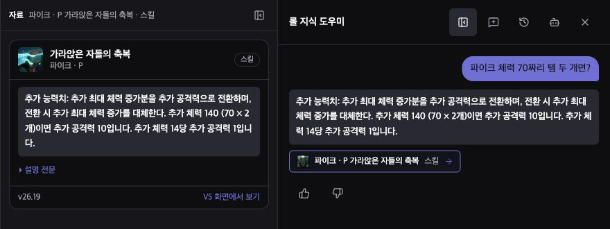

# 승인 스킬 규칙의 앱 통합 — 2026-10-04

## 포함한 자료와 흐름

173챔피언의 승인된 P/Q/W/E/R 865개, 규칙 3,478개를 `public/data/26.19/llm/champion-mechanics.json`에 포함했다. 공통 정보 173개는 기존 챔피언 카드와 함께 쓴다. 번들은 약 5.26MB이며 gzip 기준 약 696KB다.

앱의 흐름은 **질문 해석 → 전문 CC/상호작용 판정 또는 승인 스킬 규칙 조회 → 기존 조회/가이드 → 카드·대화 기억 저장**이다. 승인 규칙의 판단과 렌더링은 `src/lib/advisor/mechanics/`에 있으며 연구 답변기도 같은 `answerDialogue`를 실행한다. 연구 경로의 별도 답변 판정은 제거했다.

수치의 쉼표·한글 표기·정정·템 개수, 추가 공격의 발사/취소, 대상 종류, 보호막 쿨 상태를 코드가 해석한다. 단일 스칼라 전환은 승인된 숫자 참조로 계산한다. 음수·복수 수치·분수 개수·지원하지 않는 계산식은 확인 질문을 한다. 이 대화 기억은 실제 저장/복원 경로를 거치며 패치와 승인 원문 해시가 달라지면 이어 쓰지 않는다.

## 평가

질문 문구와 정답 기준을 바꾸지 않고 기존 경로(`abilityRules` 비활성)와 앱 통합 경로를 비교했다. 아래 통과율은 해당 질문의 필수·금지 표현 검사이며 일반적인 사용자 정확도 추정치가 아니다.

| 질문 묶음 | 기존 경로 | 앱 통합 | 설명 |
|---|---:|---:|---|
| 기존 51턴 | 26/51 | 50/51 | 기존 정답 회귀 0, 승인 성공 손실 0 |
| 지난 변형 59턴, 판정기 없음 | 13/59 | 59/59 | 수정에 사용한 고정 회귀셋 |
| 같은 59턴, 오프라인 판정기 | 13/59 | 59/59 | 생성 모델 없이 같은 결과 |
| 새 표현 17턴, 첫 실행 | 1/17 | 15/17 | 질문을 먼저 고정하고 실행 |
| 같은 새 17턴, 수정 후 | 1/17 | 17/17 | 이후로는 고정 회귀셋이며 새 독립 검증으로 세지 않음 |

새 질문에서 “전부 쏠게”를 발사로 인식하지 못해 이전 취소 조건을 재사용했고, 루시안이 받는 힐을 소환사 주문 회복으로 읽었다. 두 문제는 동사 해석과 주제/전문 판정 우선순위에서 수정했다. 초기 결과도 보존했다.

근거: [51턴](integrated-fixed-comparison.json), [59턴](variations-v1.integrated.none.json), [오프라인 59턴](variations-v1.integrated.offline.json), [새 17턴 초회](integrated-fresh.none.json), [새 17턴 수정 후](integrated-fresh.after.none.json).

## 실제 앱 검증

- 전체 단위/데이터 시험 2,128건 통과.
- 390px·1280px 브라우저 시험 2건 통과. 템 개수, 수치 정정, 공격 발사 부정, 카드 이미지, 새로고침 후 기억을 확인했다.
- 사용자 Chrome에서도 체력 70짜리 템 2개 → 추가 공격력 10, 새로고침 뒤 42로 정정 → 추가 공격력 3을 확인했다. 콘솔 오류 없음.
- 앱/스크립트 타입 검사와 로컬 빌드 통과. 규칙 조회 코드를 필요할 때 불러와 새 번들 크기 경고를 없앴다.
- 전체 린트는 다른 번역 작업의 미추적 임시 파일 `research/translation-runs/2026-10-04/parallel-review/probe-sol-cli/probe.ts`에서 오류 17개·경고 1개로 실패한다. 해당 파일만 제외한 전체 린트는 통과했다. 그 파일은 수정하지 않았다.

## 유지보수와 적용 범위

`npm run llm:mechanics-bundle`은 현재 입력·승인 해시를 확인해 일치하는 규칙만 배포 파일에 넣는다. `build`, `build:local`, `llm:bundle`에 연결되어 있고 정적 데이터의 내용 해시가 바뀌면 배포 자료 URL도 바뀐다. 기존 변경 감지/재작성/승인 파이프라인을 유지한다. 승인 없는 변경분이 자동으로 승인되는 흐름은 없다.

모든 승인 자료를 포함했지만 현재 새 조회기는 한국어와 기본 형태의 단일 스킬 질문에 사용한다. 변신·무기 선택, 복합 스킬 상호작용, 미확정 식은 기존 전문 답변/조회로 이어진다. 게임 엔진의 실제 상태를 시뮬레이션하지 않는다. 0.8B의 생성 기능은 이번 변경 범위에 포함하지 않았다.

기존 51턴에서 오로라 패시브/미니언 질문은 아직 필요한 설명이 누락된다. 865개 자료의 승인과 임의의 모든 질문에 대한 완전 답변은 구분해야 한다.

로컬 코드·자료 연결과 검증 완료. 이번 통합 변경의 커밋·푸시·배포는 아직 하지 않았다.
