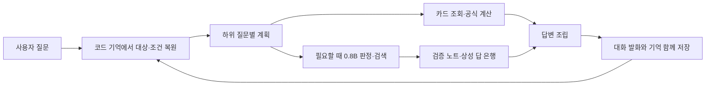

# 코드가 맥락을 보관하는 대화형 도우미

2026-10-01 · 자료 26.19 · 실제 Chrome DevTools / WebGPU / 앱의 Qwen3.5 0.8B q4 판정·검색 그래프.

최신 master와의 흐름 통합, 반복 팁 진행, 카드 재생성의 후속 점검은 [최신 점검 기록](MASTER_CHECK.md)에 있다.
그 이후 실제 0.8B의 74턴 재측정과 혼합 대화·저장 복원 결과는 [모델 재검증](MODEL_CHECK.md)에 있다.
아래 점수와 생성 실험 결과는 최초 실험 당시의 기록이다.

## 결론과 적용

코드 기억, 질문별 검증 문단 선택, 섞인 질문 분리, 불명확한 대상 확인을 앱에 적용했다.
0.8B는 판정·검색을 계속 맡는다. 생성 문장을 붙이는 실험은 실패하여 앱에 적용하지 않았다.
이번 결과는 질문의 대상과 맥락을 개선한 첫 구현이며, 모든 질문에 답하는 챗봇의 완성을 뜻하지 않는다.

기억은 현재 상성의 내/상대 챔피언, 최근 스킬/아이템/규칙 조회, 주제, 궁 랭크·가속,
사용자가 말한 스킬 사용 가능/부재 조건, 확인 중인 대상을 각각 보관한다.
사용자의 조건은 게임의 실시간 상태로 취급하지 않는다. 새 대화는 비우며, 다른 상성으로 바뀌면 이전 쌍의 조건을 비운다.
저장 기록을 열면 같은 기억을 복원하고, 패치가 다르거나 사라진 챔피언의 기억은 사용하지 않는다.

## 질문과 평가 기준

[사전 등록](PROTOCOL.md), [질문셋](questions.json): 단일 24개 + 10개 대화 × 5턴 = **74턴**.
커뮤니티의 교환, 프리징, 관통, 가속, 치유 감소 질문 수요를 조사하여 새 문장으로 작성했다.
출처는 사전 등록 문서에 있다. 오래된 커뮤니티 답변의 수치를 정답으로 가져오지 않았다.
마지막 대화 세 개, 15턴은 규칙 작성에 사용하지 않은 보류 묶음이다.

정확성·직답·맥락·실행 가능성·자연성·간결성을 평가한다.
잘못된 대상/관점/슬롯, 정정 전 조건 사용, 근거 밖의 수치, 명시적 주제 이탈은 필수 실패다.
자연성 점수가 이를 상쇄하지 않는다.

### 전체 자동 검사

| 방법 | 경로·대상 /74 | 후속 턴 /40 | 보류 대화 /15 | 핵심 내용 검사 /30 |
|---|---:|---:|---:|---:|
| 현행 | 50 | 23 | 9 | 6 |
| 코드 기억 + 질문별 근거·검증 문장 | 70 | 38 | 13 | 26 |
| 추가 아이디어 1: 명시적인 혼합 질문 분리 | 72 | 39 | 14 | 27 |
| 추가 아이디어 2: 불명확한 대상 확인 | 72 | 39 | 14 | 26 |
| 두 아이디어 결합 — 앱에 채택 | **74** | **40** | **15** | **27** |

**74/74는 전체 답변 정답률이 아니다.** 경로·대상·주제·슬롯의 선택 점수다.
자료 부재를 고지한 답도 규칙 경로는 통과하지만, 실제 질문에 답하지 못하면 내용 검사는 실패한다.
내용 검사는 사전 등록된 체크 문장을 30개 값/주제 검사로 옮긴 것으로,
모든 전투 조언의 의미를 검증하거나 새로운 게임 사실을 확인하는 도구가 아니다.
치유 감소의 중첩 두 건과 보호막 적용 한 건은 여전히 내용 검사를 통과하지 못했다.
프리징은 사전 기준이 지원되는 설명 **또는 자료 범위 고지**였으므로, 절차가 없는 것을 밝힌 응답이 통과한다.

정정 조건·숫자 유지 상태 검사 6개는 후보에서 6/6이었다. 현행에는 이 구조의 저장 상태가 없으므로 0/6;
이 수치를 현행이 모든 조건을 0번 이해했다는 뜻으로 해석해서는 안 된다.

### 원문 검토

[개발자 자체 검토](manual-review.json): 대표 개선·실패·자료 부재 사례 16개를 동일 루브릭으로 검토했다.
단일 11점/대화 14점으로 정규화하여 평균을 기록했다. 채점자는 구현자이며 방법을 알고 있었다.
무작위 표본이나 별도 평가자의 맹검이 아니므로, 이 평균은 전체 품질 추정치로 사용하지 않는다.

| 16개 표본 자체 검토 | 정규화 평균 | 필수 실패 /16 | 원자료 추가 검수 |
|---|---:|---:|---:|
| 현행 | 32.1% | 9 | 0 |
| 결합 후보 | 90.4% | 0 | 1 |

후보의 원자료 검수 건은 자동 검사로 잡히지 않았던 덤불 조끼 반사 피해 표기다.
출처 문장을 그대로 옮겼다는 것만으로 게임 사실의 정확성이 보장되지는 않는다.

관찰한 개선:

- 가렌 Q 조회 → “그럼 W는?”: 두 챔피언 비교 대신 최근 가렌 W 조회.
- 스킬 가속 50 → “아니 100으로 정정”: 궁 1랭크 조건을 유지하며 86.67초 → 65초 재계산.
- 말파이트 궁 조회 후 이전 피오라 상성으로 돌아오기: 내/상대 관점 보존.
- 가렌 Q와 점화·정복자를 한 문장에 묻기: 두 질문 모두 답변.
- 상대 W 부재 → W 존재/Q 부재 정정: 새 조건을 명시하고 응수 주의 문단 우선.
- “왜?”: 다른 세 주제로 바꾸지 않음. 같은 문단을 반복하는 경우는 아직 자연성/간결성 감점.

### 0.8B 생성 실험

첫 후보의 검증 본문에 0.8B가 한 줄 호응만 붙이도록 했다. 한국어 화면 71턴에서 실제 생성했고,
영어/중국어 화면 3턴은 생성하지 않았다. 검증된 본문을 바꾸거나 사실을 덧붙이는 출력은 버렸다.

**허용된 호응 문장 통과 0/71**, 생성 지연 중앙값 약 **1.41초**.
“점멸은 10초”, “가렌 궁에도 관통 적용” 같은 잘못된 게임 내용을 요청하지 않았는데도 썼다.
거절된 원문은 [initial/memory-surface.json](initial/memory-surface.json)에 보존했다.
이 결과는 현재 앱의 모델·양자화·그래프·프롬프트 조합에 관한 결과다.
다른 0.8B 모델의 생성 능력 전체에 대한 결론은 아니다.
호응 문장이 전부 버려져 첫 memory 후보의 답변과 최종 문장은 같았고, 비용만 추가됐다.

## 시간과 측정 조건

현행은 질문 시간 중앙값 약 1.48초, p95 3.63초였으며, 준비/다운로드 시간은 포함하지 않았다.
최종 결합 후보는 새 판정·검색 캐시에서 먼저 측정했다. 정확한 값은 [scores.json](scores.json)에 있다.
코드 조회/계산이 많은 질문셋이라 대부분은 모델을 부르지 않는다.
현행 121회 호출 중 재사용 2회, 결합 후보 18회 중 재사용 1회였다. 모델 거절/시간 초과 대체는 모두 0회였다.

다른 후보는 동일 입력의 판정·검색 출력을 재사용했다. 따라서 다른 후보의 밀리초 응답을 실제 모델 속도 향상으로 주장하지 않는다.
자동 측정은 답변 조립까지이며, UI의 글 표시 애니메이션과 저장 지연은 포함하지 않는다.
같은 질문만으로 판정을 우회하기 쉬운 작은 묶음이므로 실제 사용자의 응답 시간 분포로 일반화하지 않는다.

## 실제 화면에서 추가로 잡은 문제

로컬 `http://127.0.0.1:5173/`를 Chrome DevTools로 열고 모델 다운로드/준비, 카드와 답문, 콘솔을 확인했다.
기존 Chrome 프로필 충돌로 별도의 격리된 Chrome DevTools MCP 브라우저를 사용했다.
실제 입력창에서 더 긴 대화를 이어가며 테스트했다.

1. 예전 가렌/다리우스 상성 뒤 말파이트 궁 → 아무무 궁 비교에서 예전 쌍이 끼어들었다.
   명시적인 새 비교 대상은 최근 조회와 연결하고, 새 단일 조회는 이전 수치 비교 대상을 비우도록 수정했다.
2. “지금 정정한 조건에서 왜 조심해야 해?”를 새 정정으로 오인하여 조건을 지웠다.
   새 조건이 실제로 추출될 때만 정정을 적용하고, 이유 질문은 직전 주제를 유지하도록 수정했다.

두 사례는 고정 질문셋의 74/74가 실제 대화 전체를 보장하지 않는다는 예다.
각각 독립적인 집중 테스트를 추가했다. 화면에서 최근 조회, 혼합 질문, 정정, 확인 답변, 새 대화,
새로고침 후 기억 복원을 별도로 확인했다. 화면 콘솔 오류는 0건이었다.

증거: [수정 전 화면](current-ui.png), [개선 비교 화면](improved-ui-comparison.png),
[개선 조건 화면](improved-ui-conditions.png), [새로고침 후 복원 화면](improved-ui-restored.png),
[실제 대화 기록](improved-ui-history.json).

## 구현 검증

- 집중 테스트 31개 통과: 지칭, 관점, 혼합 질문, 계산·정정, 조건 취소, 저장·복원, 채점의 실패 판정.
- 전체 `npm test`: 1,389개 통과, 실패·건너뜀 0개.
- `npm run type-check`, `npm run lint`, `npm run build`, `git diff --check` 통과.
- 빌드의 600 kB 초과 청크 경고는 수정 전 HEAD를 별도 디렉터리에서 빌드해도 발생했다.
  이번 변경으로 주 청크는 약 725 kB에서 744 kB로 늘었다. 번들 분리는 이번 실험에 포함하지 않았다.
- 실제 Chrome 화면에서 정정된 조건을 저장하고 새로고침한 뒤 새 이유 질문으로 복원을 확인했다. 콘솔 오류 0건.

후속 구조 정리는 [대화 흐름](FLOW.md)에 기록했다. 앱의 진입점에서 맥락 복원·질문 계획·근거 조립을 실행하고,
화면 훅에서 답변과 기억을 기록한다. 기존 11개 처리기의 우선순위와 실험의 부분 조합을 유지한다.

## 남은 품질 문제

- 치유 감소 중첩·보호막 적용과 프리징 절차가 현재 지식 묶음에 없다. 다른 문서로 대신 답하지 않고 범위를 밝힌다.
- 덤불 조끼 원자료의 반사 피해가 `0`으로 기록되어 있다. 조회 대상 유지와 별개로 수치 자료 검수가 필요하다.
- 불리한 체력·아이템·레벨·정글 위치까지 추출하고 조언을 조건별로 세밀하게 바꾸지는 않는다.
- 새 지칭/수치 추출은 한국어부터 구현했다. 영어·중국어 단일 질문은 검증했지만 여러 턴은 별도 평가가 필요하다.
- “왜?”의 새로운 설명, 처음 보는 자유형 질문, 좋은 생성 문장은 추가 개선이 필요하다.

## 파일과 재현

- `current.json`: 수정 전 74턴의 원문, 계획, 구조화 답, 호출/시간.
- `memory.json`, `decompose.json`, `clarify.json`, `combined.json`: 최종 후보별 74턴.
- `initial/`: 첫 후보 비교와 생성 실험 원문. 이후 수정에 덮어쓰지 않았다.
- `questions.json`, `PROTOCOL.md`, `scores.json`, `manual-review.json`: 질문·기준·자동 결과·표본 검토.
- `scripts/llm/conversational-advisor/browser.ts`: 앱과 같은 워커·모델·계획기로 수집.
- `scripts/llm/conversational-advisor/score.ts`: 자동 채점. `node --import tsx scripts/llm/conversational-advisor/score.ts current memory decompose clarify combined initial/memory initial/memory-surface`.

Chrome에서 `import('/scripts/llm/conversational-advisor/browser.ts').then(m => m.createEvaluation())`로 평가기를 만든다.
각 질문 사례를 `runCase(id, variant)`로 순서대로 실행한다. 대화 사례 내부는 여러 턴, 사례 사이에는 새 기억을 사용한다.
결합 후보의 속도를 재려면 다른 후보보다 먼저 실행한다. 소스 편집으로 Vite가 재적재되면 수집 중인 워커/결과가 사라지므로,
완료 건수를 확인하고 결과를 먼저 저장한다.
