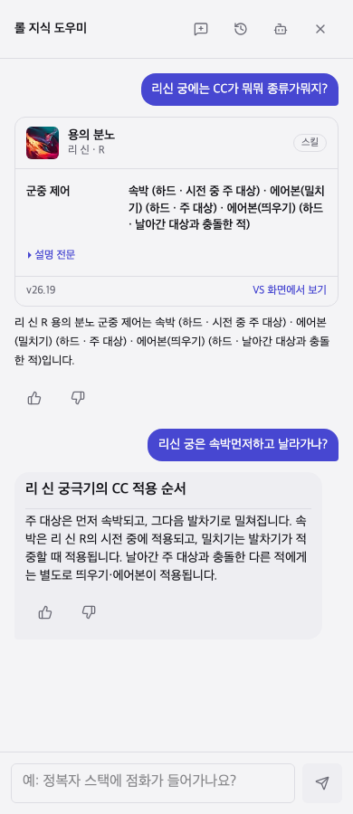

# 리 신 R 판정 조사와 질문 전환 수정 — 2026-10-02

기준 커밋: `00981056f`. PC 롤 자료 패치: `26.19`.

## 요청별 확인

| 요청 | 결과 | 확인 근거 |
|---|---|---|
| 궁 이미지 표시 | 문자 R 배지를 기존 `AbilityIcon` 스프라이트로 교체 | 실제 이미지 디코딩 검사, 390px·1280px 브라우저 시험, Chrome 확인 |
| CC 종류에서 순서로 질문이 바뀌면 다른 답변 | 검토한 순서 노트를 CC 목록 카드보다 먼저 선택 | 사용자가 보낸 두 질문 그대로 여러 턴 시험, 두 번째 카드 반복 없음 |
| 속박 해제가 밀치기를 취소하는지 조사 | 속박 해제와 시전 유효 조건 상실을 구분한 노트 추가 | 아래 PC 롤 출처 대조, 실제 도우미에서 해제 질문 확인 |
| 조사 내용을 로컬에 기록 | CC 순서·해제 상호작용 노트 2개와 이 보고서 저장 | 세 언어 본문·출처·검토일을 포함한 자료 검사와 번들 생성 |
| 기존 흐름 유지 | 조언 질문 검사 뒤 순서 조회를 적용, 효과 배열의 순서를 시간 순서로 추정하지 않음 | 전체 단위·자료 시험과 기존 질문을 포함한 60턴 평가 |

## 판정 조사 결과

기존 `knowledge/crowd-control.json`에는 리 신 R의 **시전 중 주 대상 속박 → 주 대상 밀치기 → 충돌한 적 띄우기**에 해당하는 세 효과와 대상이 있었다. 그러나 속박 해제와 후속 궁 시전의 관계를 설명하는 별도 노트는 없었다.

- 주 대상은 시전 중 속박되고, 발차기가 적중하면 밀쳐진다. 날아간 대상과 충돌한 다른 적은 별도로 뜬다. [PC 리 신 스킬 자료](https://leagueoflegends.fandom.com/wiki/Lee_Sin/LoL)
- 시전 중 속박은 정화·수은 장식띠·미카엘로 해제할 수 있다. **속박 해제만으로 후속 밀치기의 취소를 보장할 수는 없다.** 나무위키에는 속박을 해제하고 시전이 끝나기 전에 시전 유효 사거리 밖으로 이동하면 이론상 궁을 피할 수 있다고 설명돼 있다. 속박 해제와 해제 후 이동을 구분해 기록했다. [리 신 상세 설명](https://namu.moe/w/%EB%A6%AC%20%EC%8B%A0)
- 이미 적용된 밀치기·에어본은 이 세 해제 수단으로 제거할 수 없다. 수은의 에어본 제거와 에어본 중 사용이 제거된 변경은 Riot 10.23 패치에도 명시돼 있다. [현재 수은 장식띠 자료](https://leagueoflegends.fandom.com/wiki/Quicksilver_Sash), [Riot 10.23 패치 노트](https://www.leagueoflegends.com/en-us/news/game-updates/patch-10-23-notes/)
- Meraki의 스킬 설명도 시전 도중 대상이 너무 멀어지거나 대상 지정 불가가 되는 등 유효 조건을 잃으면 시전이 취소된다고 설명한다. 이 자료에는 이전 패치 내용이 포함돼 있어 취소 사거리의 특정 숫자를 현재 패치의 확정값으로 넣지 않았다. [Meraki 챔피언 자료](https://cdn.merakianalytics.com/riot/lol/resources/latest/en-US/champions.json)
- CC 해제 자체는 피해를 제거하는 효과가 아니다. 다만 실제로 시전이 취소된 경우의 피해 발생·정확한 프레임 조건은 이번에 PC 클라이언트에서 재현하지 않았다.

사용자가 기억하는 상황이 속박 해제 후 이동이나 과거 수은+점멸 동작일 가능성은 있지만, 영상이나 게임 재현 없이 어느 경우였는지는 단정하지 않는다. 이전 답변에는 시전 취소 조건이 빠져 있었다.

## 원인과 수정

### 스킬 이미지

이미지 URL 실패가 원인이 아니었다. 스킬 카드가 의도적으로 `SlotBadge`의 R 문자만 표시하고 있었다. 카드에 이미 있는 챔피언 ID·슬롯·데이터 버전을 기존 `AbilityIcon`에 전달해 동일한 스킬 이미지 자산을 사용한다. 테스트는 DOM 존재뿐 아니라 실제 배경 이미지의 디코딩 성공도 확인한다.

### 질문이 바뀌어도 반복한 답변

“속박 먼저”가 CC 종류 조회로 분류돼 검토한 순서 설명보다 목록 카드가 먼저 반환됐다. 순서 문형과 CC·이동 표현을 함께 검사하고, 일치하는 출처 노트가 있으면 순서 설명을 반환하도록 수정했다. 새로운 챔피언의 순서는 CC 배열만 보고 만들어내지 않는다.

`leesin-r-sequence`는 챔피언·궁·순서·효과 표현을 모두 요구한다. “궁 먼저 쓰는 콤보” 같은 일반 조언이 새 노트로 넘어가지 않도록 했다. `leesin-r-cleanse`는 해제 표현을 요구해 일반 CC 종류 질문과도 구분한다.

## 시험 결과

| 검사 | 결과 |
|---|---|
| 단위·자료 시험 | `1,897/1,897`, 실패·건너뜀 없음 |
| 질문 묶음: 56대화, 60턴 | 판정기 없음 `60/60`, 오프라인 판정기 `60/60` |
| 390px·1280px 브라우저 시험 | 재시도 없이 `5/5` |
| 실제 Chrome 로컬 대화 | CC 종류 → 순서 → 속박 해제 조건, 세 답변 확인 |
| 타입 검사 / ESLint | 통과 |
| 빌드 / Pages 아티팩트 준비 | 통과 |

질문 묶음에는 정화·수은·미카엘, 해제와 피해, 사용자의 두 질문, 역순으로 묻는 질문이 포함돼 있다. 직접 조회 시험은 모델을 호출하면 실패한다. 새 노트는 2개이며, 현재 출처 노트는 25개, 기존 규칙을 합친 번들 판정 문서는 32개다.

이 수치는 정의한 질문과 단언의 통과율이며 임의의 모든 질문에 대한 정확도는 아니다. 게임 판정은 출처 대조 결과이고 실제 게임에서의 재현 결과가 아니다.



## 다시 실행

```bash
npm run llm:bundle
npx tsx scripts/llm/eval-dialogue-coverage.ts research/llm-evals/crowd-control/after.json research/llm-evals/crowd-control/questions.json 00981056f
node --import tsx --test --test-reporter=spec 'tests/unit/*.test.ts' 'tests/data/*.test.ts'
npm run build
npm run test:e2e -- e2e/advisor-crowd-control.spec.ts --retries 0
```
