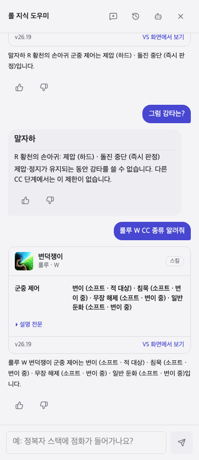

# CC 분류와 위키 세부 판정 — 2026-10-02

최초 검토 기준 커밋: `d0eb4d360`, PC 롤 자료 패치: `26.19`.
배포 전 `987fa7166`의 패치 기록 화면 변경을 합친 뒤 검사와 빌드를 다시 확인했다.

이하 표는 최초 CC 분류 작업 당시의 결과다. 이후 `00981056f`를 기준으로 리 신 궁 이미지와
CC 순서·해제 질문을 보완했다. 현재 `after.json`과 `questions.json`은 56대화·60턴이며,
출처 노트는 25개, 번들 판정 문서는 32개다. 후속 검사는 단위·자료 `1,897/1,897`,
질문 평가 양쪽 `60/60`, 브라우저 `5/5`를 통과했다.
판정 조사와 요청별 확인은 [리 신 R 후속 보고서](./leesin-review.md)에 기록했다.
그 뒤 챔피언 전반의 질문 전환·해제·대화 기억을 점검한 결과는
[CC 질문·대화 전반 보고서](../control-audit/review.md)에 기록했다.

## 요청별 확인

| 요청 | 적용 결과 | 확인 근거 |
|---|---|---|
| 강타·수호천사·CC 판정을 기록 | 부활 중 소환사 주문 대기시간, CC 중 강타 예외를 별도 노트로 저장 | 위키 판정 노트와 Riot 11.20 수정 기록, 실제 도우미 질문 시험 |
| 기존 챔피언 스킬마다 CC 종류 표시 | 173챔피언의 865슬롯에 메타데이터. 359슬롯에 구체적 효과, 3슬롯은 복사·지배·반사에 따라 달라짐 | 실재 슬롯·세 언어 동일성·출처 검사 |
| 하드·소프트와 정확한 종류 구분 | 25종. 이동 불가/강제 행동을 하드로 쓰는 프로젝트 기준을 명시 | 강타 사용은 별도 속성으로 제압·정지에서만 차단 |
| 조건과 대상 오인 방지 | 자신·아군·적·양쪽·챔피언 제외 구분. 스택, 변신, 무기, 시전 단계 조건 보존 | 애니·케인·아펠리오스·룰루·바드·바루스·그레이브즈 등 질문 시험 |
| 위키의 기존 노트에 없는 세부 규칙 추가 | 출처와 검토일을 가진 23노트. 정화/수은, 강인함, 졸음/수면, 실명/시야 축소, 치유 감소, 대상 지정 불가 등 | 한국어·영어·중국어 본문과 질문 조건 검사 |
| 실제 대화에서 사용 | 앱의 `answerDialogue`와 일반 계획기에서 공통 조회. CC 카드 뒤 “그럼 강타는?”도 이전 스킬을 사용 | 저장/복원한 대화 내역을 사용하는 여러 턴 시험, 브라우저 확인 |
| 기존 질문 유지 | 상성 조언을 CC 조회가 가로채지 않고, 수치 질문은 기존 사실 조회 유지 | 전체 단위·자료 시험과 기존 대화/예외 질문 묶음 |
| 패치 변경 시 과거 판정 재사용 방지 | 패치와 한국어 본문 지문 확인. 달라지면 툴팁 추정으로 표시 | 패치/본문 변경 시험, 복사된 궁의 강타 가능 여부 단정 금지 시험 |

## 자료와 대조 방법

- `knowledge/crowd-control.json`: 현재 한국어 스킬 본문·효과 태그를 바탕으로 만든 슬롯 목록에 위키 보정을 적용했다. 보정마다 출처와 필요한 발동 조건이 있다.
- `knowledge/mechanics-notes.json`: PC 롤의 CC·아이템·소환사 주문 상호작용을 짧은 판정 단위로 정리했다. 기존 7개 게임 규칙과 합쳐 번들은 30개 판정 문서를 가진다.
- 현재 위키, CC 종류별 스킬 목록, Meraki 스킬 설명을 대조했다. Meraki 자료에는 이전 패치 내용도 있어 현재 툴팁과 충돌하는 리워크는 현재 자료를 우선했다. 쉬바나 R의 공포를 과거 밀치기로 덮어쓰지 않았다.
- 카밀 E의 적 충돌은 기절·밀치기이며 자기 벽 이동을 적 당기기로 읽지 않는다. 아우렐리온 솔 E와 렐 R의 행동 가능한 끌림은 에어본과 구분했다. 나미 Q의 특수 기절 판정과 벨코즈 E의 기절+에어본도 분리했다.
- 모데카이저 궁 수은 탈출 제거는 [Riot 14.8 패치 노트](https://www.leagueoflegends.com/en-au/news/game-updates/patch-14-8-notes/)로 대조했다. 각 노트의 다른 원출처는 데이터에 보존했다.
- `docs/lol-fundamentals.md`에서 삭제된 강인함 룬 예시와 잘못된 공격 속도 감소 아이템 예시도 수정했다.

자료를 출처로 대조한 작업이며, PC 클라이언트에서 모든 스킬 판정을 재현한 시험은 아니다.
기존 스킬 수치·본문은 다시 생성하지 않았다. 영어·중국어 CC 종류와 대상은 번역하지만,
상세 조건 문장은 아직 `conditional`/`有条件` 표시로 제공한다.

## 시험 결과

| 시험 | 결과 |
|---|---|
| 새 질문 묶음: 49대화, 52턴 | 판정기 없음 `52/52`, 오프라인 판정기 `52/52` |
| 기존 대화 묶음 | 양쪽 각각 `43/43` |
| 기존 예외 질문 묶음 | 양쪽 각각 `30/30` |
| 단위·자료 시험 | 최초 `1,781/1,781`, 최신 master 통합 후 `1,890/1,890`. 실패·건너뜀 없음 |
| 타입 검사 / ESLint | 통과 |
| 빌드 / Pages 아티팩트 준비 | 통과 |
| 새 브라우저 시험 | 재시도 없이 `3/3` — 390px·1280px 카드/이어 묻기, 부활·수은·치감 조회 |
| 기존 대화 수정 브라우저 시험 | 새 시험과 함께 실행했을 때 `6/6` 통과 |

`after.json`, `prior-dialogue.json`, `prior-edge.json`에 실제 답변과 각 단언의 결과를 남겼다.
새 질문의 직접 조회 시험은 모델을 호출하면 실패하도록 해 두었다. 이번 수치는 정의한 질문과
단언의 통과율이며 일반적인 모든 질문의 정확도 점수는 아니다.



## 회귀 문제와 적용 범위

- 처음에는 “CC”가 든 상성 조언도 새 조회로 들어갔다. 공통 조언 문형과 상성 맥락을 검사해 기존 조언 흐름을 유지했다.
- 새 판정 노트의 “시야” 같은 낱말이 부쉬·시야 질문의 검색 결과를 밀어냈다. 일반 검색에도 `questionGroups`를 보존하고 적용해 무관한 노트는 후보에서 제외했다.
- 복사·반사한 스킬은 CC 정보가 비어 있다는 이유로 강타 가능이라고 단정하지 않는다. 실제 효과를 확인해야 한다고 답한다.
- 일반 상성 조언의 기존 효과 태그를 새 메타데이터로 전부 교체한 것은 아니다. 조건부 CC의 스택·단계까지 조언 조건에 반영하려면 별도 상태 모델이 필요하다. 이번 범위는 스킬 카드·CC 조회·확인된 규칙 조회다.
- 새 판단 로직은 별도 파일로 두었다. 기존 `facts.ts`는 이미 400줄을 넘는 응집된 사실 카드 모듈이며, 이번에는 타입 import와 선택 필드만 추가했다.

## 다시 실행

```bash
npx tsx scripts/llm/attach-crowd-control.ts
npm run llm:bundle
npx tsx scripts/llm/eval-dialogue-coverage.ts research/llm-evals/crowd-control/after.json research/llm-evals/crowd-control/questions.json 00981056f
npm run test:e2e -- e2e/advisor-crowd-control.spec.ts --retries 0
```

유형별 직접 조회를 늘릴 때는 먼저 질문 묶음에 사용자 표현을 추가하고, 기존 상성 조언·스탯·스킬 수치 조회를 함께 확인한다.
