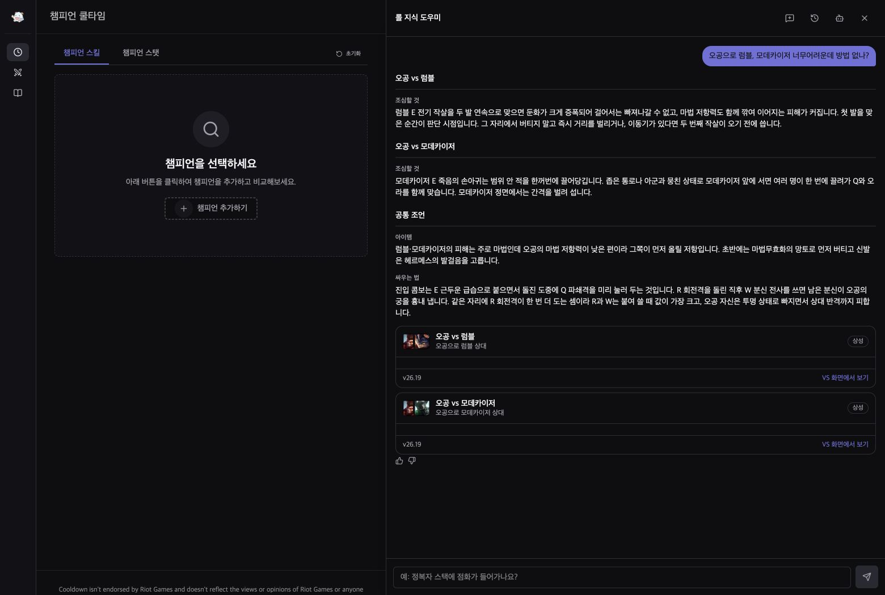
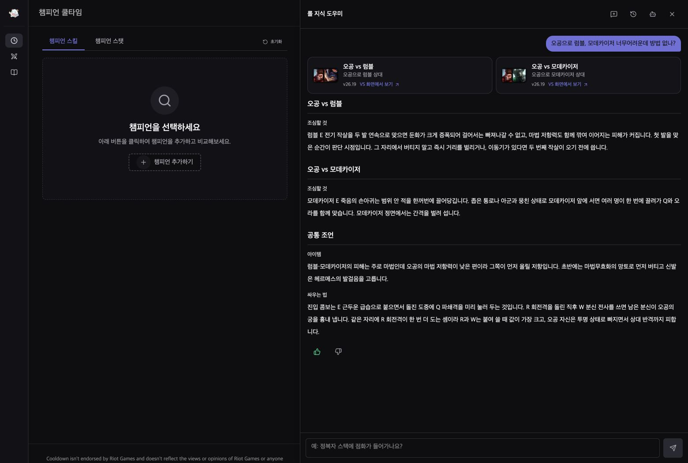
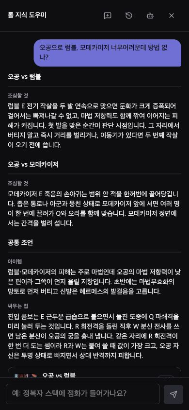
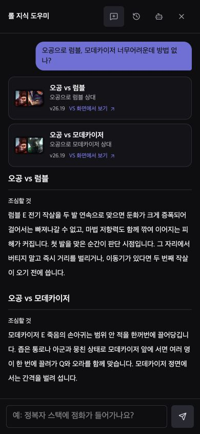
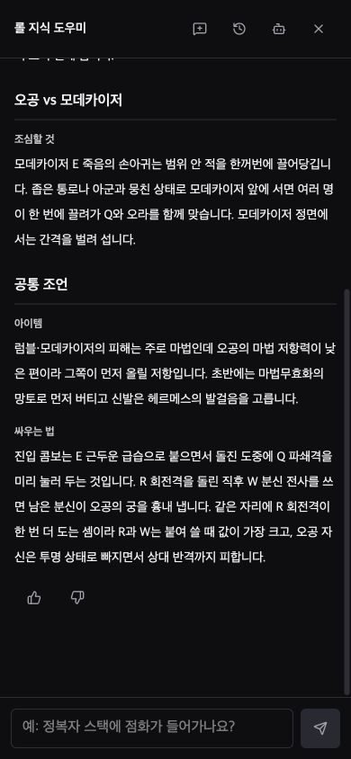
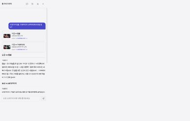

# 상성 도우미 화면 점검 — 2026-10-02

질문: `오공으로 럼블, 모데카이저 너무어려운데 방법 없나?`

Chrome에서 실제 화면을 캡처했다. 기본 데스크톱 뷰포트는 1560×1050,
모바일 크기 점검은 390×844와 320×740이다. 모바일 검증은 데스크톱 Chrome의
뷰포트 변경이며 실제 휴대폰의 소프트 키보드·노치 동작까지 검증한 것은 아니다.

## 발견한 문제와 적용한 아이디어

| 발견 | 변경 | 확인 |
| --- | --- | --- |
| 모바일 첫 화면에서 두 상성 카드를 찾기 어려움 | 두 카드를 조언 위에 배치. 넓으면 나란히, 좁으면 세로로 표시 | 390px에서 두 카드 모두 입력창 위에 보임 |
| 내용 없는 카드 본문이 빈 띠로 남음 | 자료 카드를 별도 컴포넌트로 표시. 카드 전체를 해당 VS 링크로 사용 | 빈 본문 제거, 링크 높이 약 84px |
| 상성 제목·소제목·본문의 차이가 약함 | 상성 제목 16px, 소제목 12px, 본문 14px와 줄 간격 28px | 어두운·밝은 테마 캡처 확인 |
| 평가 버튼의 누를 수 있는 영역이 14px | 평가·보내기 버튼 44×44px, 키보드 포커스 표시 | 평가 상태 변경과 Tab → Enter 이동 확인 |
| 질문 입력칸에 고정 접근성 이름이 없음 | 한국어·영어·중국어 입력 라벨 추가, 모바일 하단 안전 영역 반영 | 화면 읽기용 이름과 실제 입력 동작 확인 |
| 새 방문에서 자료가 오기 전에 질문하면 정확한 답을 못 한다고 종료 | 첫 질문도 위젯이 받는 자료 Promise를 기다림 | 자료 요청을 묶어 뒀다가 질문 후 풀어 주는 회귀 시험 통과 |

## 코드 점검 위치

- `src/components/features/advisor/AdvisorTurnView.tsx:118` — 카드 배치와 본문 읽기 간격.
- `src/components/features/advisor/MatchupReferenceCard.tsx:21` — 실제 링크, 쌍별 접근성 이름, 포커스 표시.
- `src/components/features/advisor/AdvisorMarkdown.tsx:47` — 제목 계층과 소제목 구분.
- `src/components/features/advisor/AdvisorTurnFooter.tsx:25` — 평가 버튼 터치 영역과 선택 상태.
- `src/components/features/advisor/AdvisorComposer.tsx:31` — 입력 라벨과 모바일 입력 영역.
- `src/components/features/advisor/useAskAdvisor.ts:102` — 첫 질문의 자료 준비 대기.

접근성·포커스·콘텐츠 넘침 점검에는 [Web Interface Guidelines](https://raw.githubusercontent.com/vercel-labs/web-interface-guidelines/main/command.md)를 참고했다.

## 검증

- 단위·자료 시험 1,688개 통과.
- 타입 검사, lint, 프로덕션 빌드, Pages 산출물 준비 통과.
- `e2e/advisor-matchups.spec.ts`: 390px·1440px 두 시험 통과.
  자료가 늦게 도착해도 첫 질문에 두 카드를 만들고, 본문보다 먼저 보여 주며,
  키보드로 두 번째 VS 화면에 이동하는지 확인한다.
- 대화 평가: 모델 없음·오프라인 판정 각각 41/41 유지.
- Chrome 수동 검증: 320px·390px 가로 넘침 없음, 44px 평가 버튼 상태 변경,
  카드 키보드 이동, 두 테마의 읽기 흐름 확인.

## 캡처

### 데스크톱 — 이전 / 이후

### 모바일 — 이전 / 이후

### 모바일 하단과 밝은 테마

